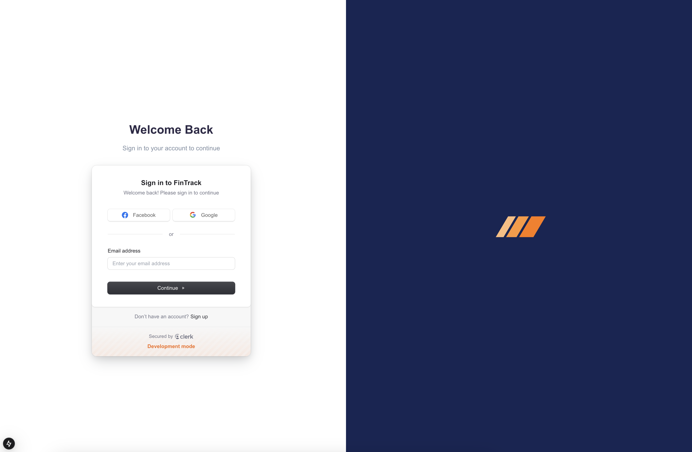
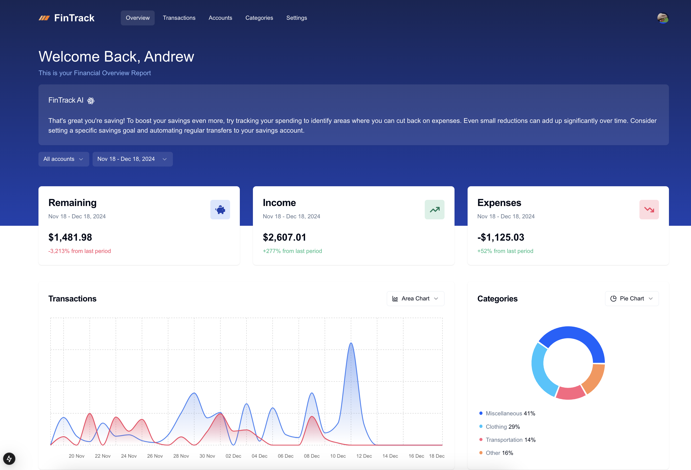
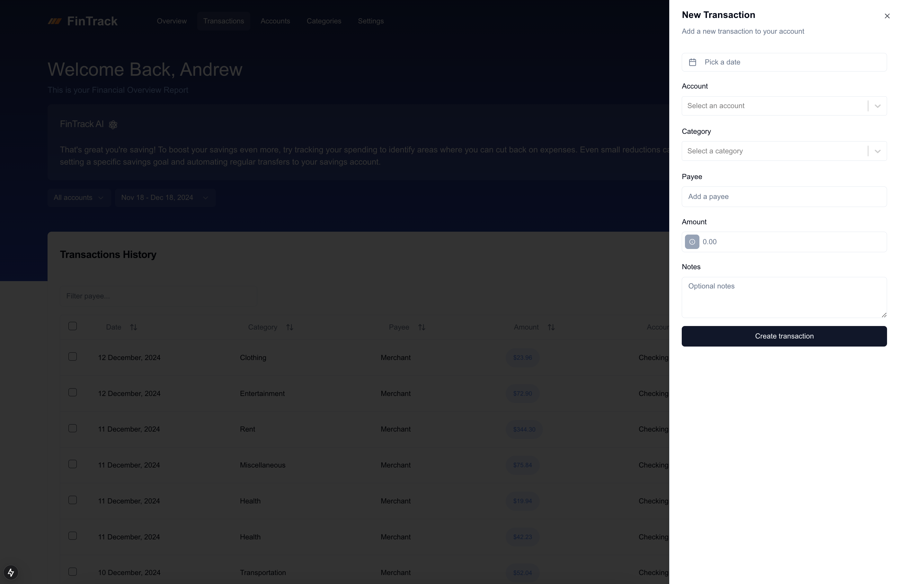

A full-stack Income and Expenses Tracker SaaS web application built with Next.js, featuring AI-powered personalized financial advice to help users manage their finances effectively.

## Overview

This finance tracker application provides users with a comprehensive summary of their financial data, including income, expenses, and savings. Users has the ability to enter the transactions manually, import transactions from CSV files, or connect their bank accounts to automatically import transactions. The application also provides personalized financial advice based on the user's financial data.

## Features
- **Landing Page**: Responsive landing page to show users the details about the application.
- **Responsive Design**: Adjusts layout for desktop, tablet, and mobile views.
- **Personalized Financial Advice**: AI-powered financial advice based on user's financial data.
- **Transaction Management**: Users can enter transactions manually, import transactions from CSV files, or connect their bank accounts to automatically import transactions.
- **Data Visualization**: Provides a visual representation of user's financial data, including income, expenses, and savings with charts and graphs.

## Technologies
- Frontend:
  - **Next.js**: Client-side, server-side rendering and static site generation.
  - **React**: UI components.
  - **TypeScript**: Type safety for JavaScript code.
  - **Shadcn**: UI components.
  - **Zustand**: State management for React applications.
  - **Tailwind CSS**: Styling.
  
- Backend:
  - **Hono**: Server-side framework.
  - **Drizzle**: Database ORM.
  - **PostgreSQL**: Database.
  - **Clerk**: Authentication and authorization.
  - **Google Generative AI**: AI-powered personalized financial advice.

## Screenshots

### Landing Page [Link](https://finance-tracker-pied-tau.vercel.app/welcome)


### FinTrack App [Link] (https://finance-tracker-pied-tau.vercel.app/)




## Getting Started

First, run the development server:

1. Clone the repository:
```bash
git clone <repo_url>
```

2. Install dependencies:
```bash
npm install
```

3. Create a `.env` file based on the `.env.example` file:
```bash
cp .env.example .env
```

Setup Clerk and PostgreSQL by obtaining a publishable key and secret key from [Clerk](https://clerk.com/). Then, update the `.env` file

4. Start the development server:
```bash
npm run dev
```

Open [http://localhost:3000](http://localhost:3000) with your browser to see the result.

## Learn More

To learn more about the technologies used in this project, take a look at the following resources:

- [Next.js Documentation](https://nextjs.org/docs) - learn about Next.js features and API.
- [Learn Next.js](https://nextjs.org/learn) - an interactive Next.js tutorial.
- [Zustand](https://github.com/pmndrs/zustand) - a state management library for React.
- [Shadcn](https://ui.shadcn.com/) - a collection of accessible, composable, and customizable React components.
- [Tailwind CSS](https://tailwindcss.com/) - utility-first CSS framework.
- [Hono](https://hono.dev/) - a fast, lightweight and flexible web framework for Node.js.
- [Drizzle](https://drizzle.org/) - a database ORM for Node.js.
- [Clerk](https://clerk.com/) - a powerful and easy-to-use authentication and authorization solution for web and mobile applications.
- [Google Generative AI](https://cloud.google.com/generative-ai) - a powerful and flexible AI platform for generating human-like text, images, and voice.


## Deploy on Vercel

The web application is deployed on Vercel at [https://finance-tracker-pied-tau.vercel.app/](https://finance-tracker-pied-tau.vercel.app/).